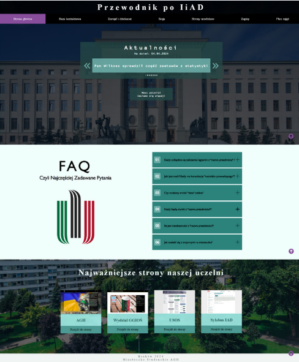
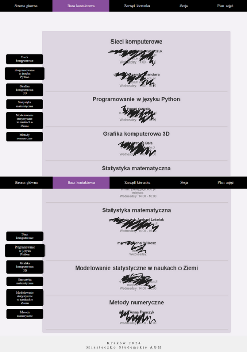
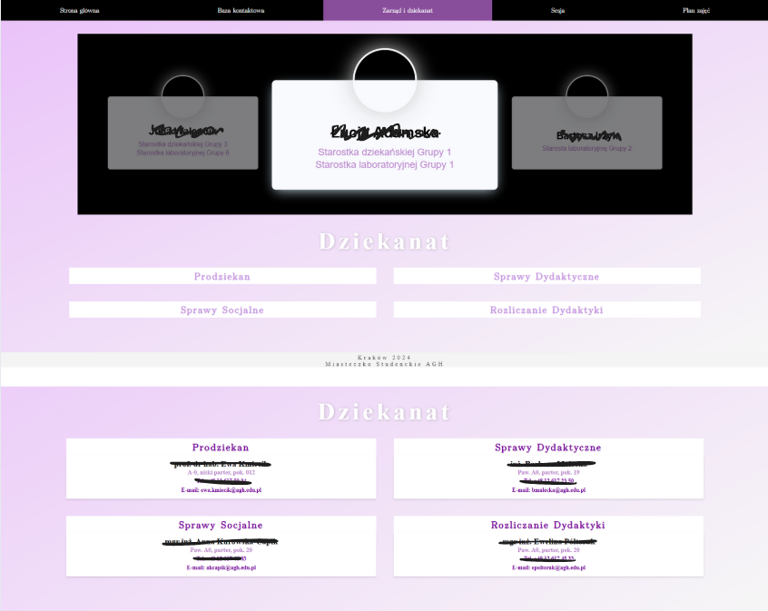
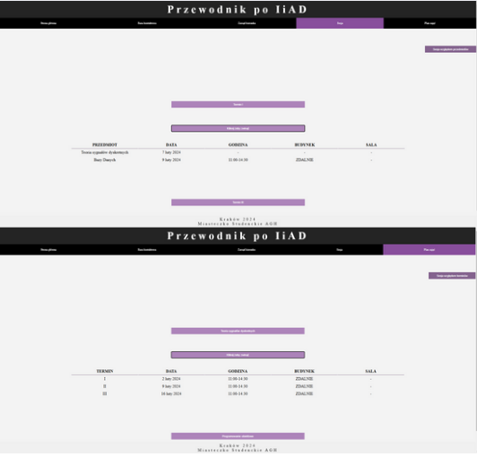
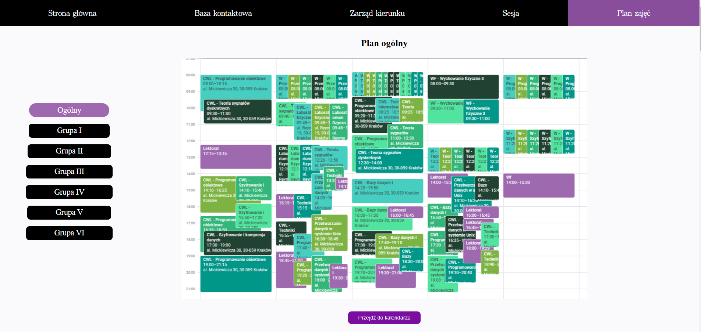

# Guide for the Data Engineering and Analysis Program

## About the Project

This website is a central resource for students of the Data Engineering and Analysis program. It provides important information, including:

### 🏠 Home Page
Find the latest updates, **Frequently Asked Questions (FAQ)**, and useful links.

### 📇 Contact Database
Access information about lecturers, their courses, and contact details.

### 🏛 Program Board
Get in touch with group leaders, year representatives, and the **faculty contact directory**.

### 🎓 Exam Sessions
View exams grouped by **dates or subjects** to easily track your schedule.

### 📅 Class Schedules
Access all schedules in one place, including the complete **year schedule** and **individual group schedules**.

## 🔹 Responsibilities
- **Kasia:** Home Page and Program Board
- **Karolina:** Contact Database, Exam Sessions, and Class Schedules
